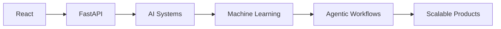

<div align="center">

# 👋 Hey, I'm Rhythem Sabharwal

### Full Stack Developer • AI/ML Enthusiast • Building AI Products

<p>
<a href="https://portfolio-pqfa.vercel.app">

</a>

<a href="https://linkedin.com/in/rhythemsabharwal">

</a>

<a href="mailto:rhythemsabharwal@gmail.com">

</a>
</p>


</div>

---

## 🚀 About Me

* 🎓 B.Tech CSE @ BPIT Delhi (2023–2027)
* 🤖 IIT Ropar AI Certification
* 💻 100+ LeetCode Problems Solved
* 🌱 Learning AI Systems, ML Engineering & Scalable Backends
* ⚡ Currently building **FoodLens AI**

---

# 🛤️ My Builder Journey

```text
⚒️ CryptoForge
      ↓
🤖 Code Reviewer
      ↓
🎨 ArtBot
      ↓
🌿 Amrutam
      ↓
🎓 College AI
      ↓
🌾 FarmWise
      ↓
📚 LeetCode Notes
      ↓
🔬 NeuralLens
      ↓
🍕 FoodLens AI
      ↓
🚀 Future AI Platforms
```

| Project           | Biggest Learning            |
| ----------------- | --------------------------- |
| ⚒️ CryptoForge    | HTML, CSS, JavaScript       |
| 🤖 Code Reviewer  | APIs & Backend              |
| 🎨 ArtBot         | Full Stack Development      |
| 🌿 Amrutam        | Rapid UI Building           |
| 🎓 College AI     | RAG Systems                 |
| 🌾 FarmWise       | XGBoost & OpenCV            |
| 📚 LeetCode Notes | Productivity Automation     |
| 🔬 NeuralLens     | Deep Learning               |
| 🍕 FoodLens AI    | Agentic AI & Search Systems |

---

# 🔥 Featured Projects

### 🍕 FoodLens AI *(Current)*

AI-powered food discovery engine that compares restaurants using natural language.

```text
"Cheap pizza under ₹200"
"Best biryani for 4 under ₹800"
```

**Tech:** React • FastAPI • Gemini • Playwright

---

### 🔬 NeuralLens

CNN + ResNet50 image classification platform trained on CIFAR datasets.

**Tech:** TensorFlow • Keras • Flask

---

### 🌾 FarmWise

Smart India Hackathon agricultural platform using OpenCV + XGBoost.

**Tech:** React • Flask • OpenCV • XGBoost

---

### 🎓 College AI

Custom RAG system for answering college-related questions using private datasets.

**Tech:** React • Node.js • AI APIs

---

# 🧰 Tech Stack

### Languages


### Frontend


### Backend


### AI / ML


---

# 📊 Current Focus



---

# 🔮 What's Next?

### 🚆 RailwayLens

FoodLens-style AI platform for train travel optimization.

### 🛡️ FraudLens

AI-powered fraud detection for:

* Bills
* Receipts
* Invoices
* Documents

Using OCR + Computer Vision + Deep Learning.

### 🍕 FoodLens 2.0

* Multi-platform comparison
* Swiggy Integration
* MagicPin Integration
* Personalized recommendations
* Cloud deployment

---

# 📈 2026 Goal

```text
Frontend Developer
        ↓
Full Stack Developer
        ↓
ML Engineer
        ↓
AI Product Engineer
        ↓
Founder / Builder
```

---

<div align="center">

### Building products. Learning publicly. Improving continuously.

⭐ Open to internships, collaborations, and startup opportunities.

</div>
